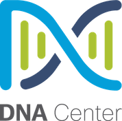

# Kosha Cisco DNA Center Connector



The Cisco DNA Center Intent REST API exposes specific capabilities of the Cisco DNA Center platform and provides policy-based abstraction of business intent, allowing focus on an outcome rather than struggling with individual mechanisms steps.

Using the Kosha Cisco DNA Center connector, you can perform REST API operations to discover and control the network. 

## Useful Actions

You can use the Kosha Cisco DNA Center connector to manage networks, sites, operational tasks, and policies.  

Refer to the Kosha Cisco DNA Center connector [API specification](openapi.json) for details.

### Know Your Network Domain

Use the Know Your Network API to perform GET operations for clients, sites, topology, devices, and issues You can also perform POST, PUT, and DELETE operations to create and manage sites, devices, IP Pools, edge and border devices, and authentication profiles.

### Site Management

Use the Site Management API to do site design, manage network settings, device onboarding, Software Image Management (SIM), and configuration templates.

### Operational Tasks

Use the Operational Tools API to access and manage backups, discover network devices, trace paths through the network, identify and discover network components using SNMP and other discovery protocols.

### Policy

Use the Policy API to create application policies used to reflect your organization's business intent and translates them into network-specific and device-specific configurations required by the different types, makes, models, operating systems, roles, and resource constraints of your network devices.

## Example Usage

The following request assigns a device to a site:

```
curl -L --request POST \
--url https:///dna/intent/api/v1/assign-device-to-site/{siteId}/device \
--header '__runsync: null' \
--header '__persistbapioutput: true' \
--header '__runsynctimeout: 55' \
--header 'Content-Type: application/json' \
--header 'Accept: application/json' \
--data '{
    "device": [ { "ip": "123.456.789" } ]
}'
```

## Authentication

Authentication requires your Cisco DNA Center server URL, username, and password. The Kosha Cisco DNA Center connector automatically injects an `X-Auth-Token` header for every request made.

To work properly, The Kosha Cisco DNA Center connector must be able to reach the server URL. Configure your firewall rules appropriately.
